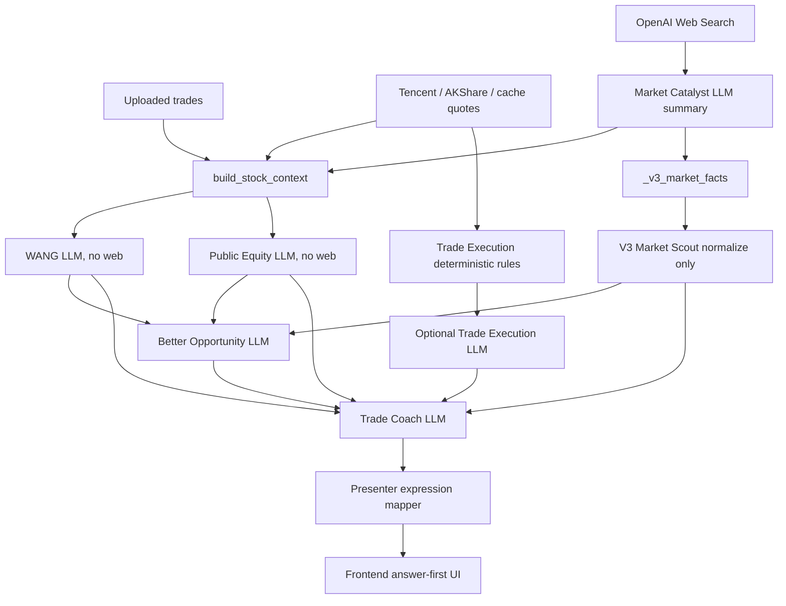
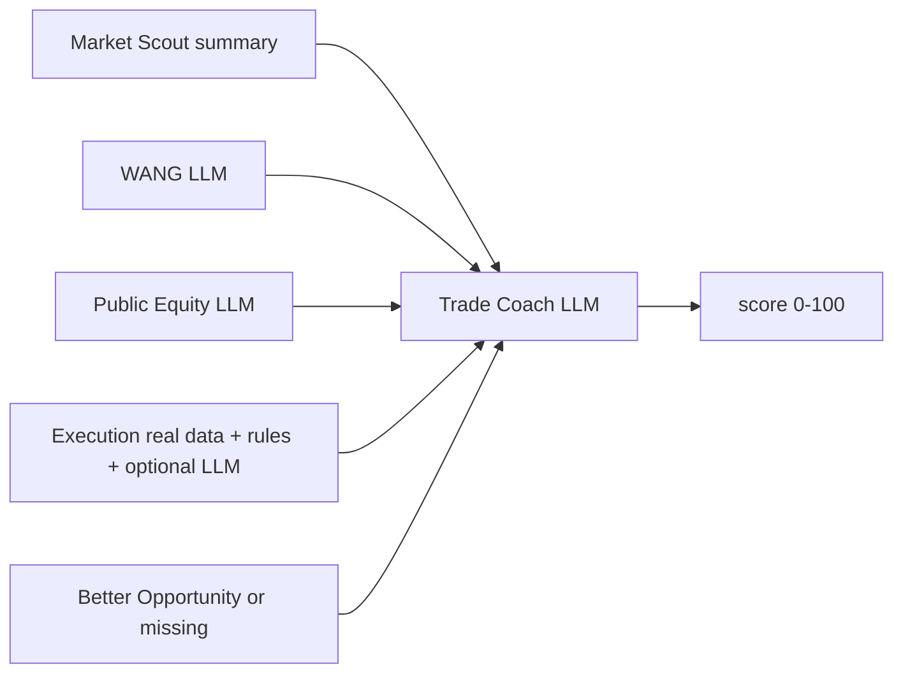
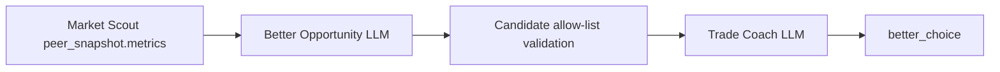

# V3 Cross-Agent Data Sufficiency and Lineage Audit

审计日期：2026-06-12

## Full Lineage



重要断点：

- WANG 和 Public Equity 是并行执行，不存在 WANG -> Public 的生产调用：
  `industry_agent.py:102-112`
- `_context_with_wang_pre_read()` 虽存在于 `industry_agent.py:208-226`，但没有被调用
- Trade Execution peers 没有进入 V3 `peer_snapshot`
- Market Catalyst 的字符串证据没有满足 V3 fact object contract

## Final Answer Field Lineage

### `ai_final_answer.score`



生成：`v3_trade_coach_agent.py:135-197`。

校验：只验证 0-100，不验证评分公式：`v3_trade_coach_agent.py:282-289`。

结论：纯 LLM 综合评分，无可复算公式，无字段贡献度。

### `verdict`

来源同 score，由 Coach LLM 生成。

数据充分性 gate 只要求 Execution 可用且 WANG/Public 至少一个非空：
`v3_trade_coach_agent.py:57-75`。

结论：即使没有财务、估值、同行和可信新闻引用，也可生成 verdict。

### `better_choice`



硬门槛：

- 必须有非目标同行
- 必须有非空 metrics
- LLM 候选必须精确匹配 allow-list

证据：`v3_better_opportunity_agent.py:61-90,111-162`；
`v3_trade_coach_agent.py:148-170,250-264`。

生产缺口：当前没有代码构造 `peer_snapshot.metrics`。

结论：逻辑安全，但高频为空。

### `main_reason`

由 Coach LLM 自由文本生成：`v3_trade_coach_agent.py:143-160`。

没有 claim-to-evidence ID，也没有要求引用具体路径。

结论：无法知道它究竟依赖行情、WANG、Public 还是规则文本。

### `mistake_source`

由 Coach LLM 生成并枚举归一化为：

- selection
- execution
- both
- none
- insufficient_data

证据：`v3_trade_coach_agent.py:267-279`。

但输入 Execution 已混合规则与 LLM，Public 可能无财务依据。

结论：输出枚举清晰，归因证据不足。

### `next_action`

由 Coach LLM 生成。其输入可能包含 Trade Execution 的硬编码规则：
`trade_execution_agent.py:221-248`。

结论：最终 trace 标 `llm`，但内容可能是规则模板的自然语言改写。

## Evidence Field Lineage

| 字段 | 直接来源 | 实际来源问题 |
|---|---|---|
| `why_stock_moved.market_theme` | Market Scout | 常是旧 Web LLM 摘要，被标 real_data |
| `why_stock_moved.market_catalyst` | Market Scout | 字符串 contract 不兼容，常为空 |
| `why_stock_moved.sector_strength` | Market Scout | 上游无生产者 |
| `investment_thesis.industry_position` | WANG | LLM 推理，无行业数据库 |
| `investment_thesis.profit_flow` | WANG | LLM 估计，无利润池数据 |
| `investment_thesis.quality_rating` | Public | LLM 评级，无财务数据 |
| `investment_thesis.expectation_gap` | Public | LLM 推理，无一致预期 |
| `better_candidates` | Better | 依赖当前不存在的 peer snapshot |
| `mistake_diagnosis.execution` | Execution | 混合 real/rule/LLM |
| `mistake_diagnosis.research_risks` | Public | LLM |
| `mistake_diagnosis.weakest_industry_link` | WANG | LLM |
| `future_rules` | Coach | LLM，可能重述规则模板 |

构造证据：`v3_trade_coach_agent.py:78-112`。

## Source Trace Accuracy Audit

### Accurate or Mostly Accurate

- WANG/Public 顶层标 `llm`
- Coach 最终字段标 `llm`
- Better 缺失时标 `missing`
- 空字段不再补默认 B/50

### Inaccurate

1. **Market Scout 顶层/叶子**
   - 当前主链无 caller，所以统一从 `real_data` 开始
   - 输入事实可能来自旧 Web LLM

2. **Trade Execution 顶层/叶子**
   - Pipeline 统一写 `real_data`
   - 实际含规则、hardcode、fallback 和 LLM

3. **why_stock_moved**
   - Pipeline 固定把 Market Scout 证据归为 `real_data`
   - 没有继承 Market Catalyst 的 LLM 来源

4. **answer_evidence.mistake_diagnosis**
   - Coach 成功后统一为 `llm`
   - 其中 execution 子对象在叶子 trace 中也可能被粗粒度覆盖

### Trace Overwrite Behavior

`visual_report.py:401-416` 先用 V3 trace 替换 workbench trace，再仅恢复 Market Scout/WANG/Public
三个上游前缀。这个动作保留旧 WANG/Public trace，但无法修复：

- V3 Market Scout 顶层来源错误
- Trade Execution 叶子来源错误
- 最终字段没有依赖图

## Data Sufficiency Gates

| 结论 | 当前 gate | 应有 gate | 审计 |
|---|---|---|---|
| score | Execution + WANG/Public 非空 | 核心证据覆盖、来源可信度 | 太宽松 |
| verdict | 同上 | 行情、产业、公司、执行分别有结论状态 | 太宽松 |
| better_choice | 同行 metrics + 行业上下文 | 再加财务/估值/日期/来源一致性 | 基础 gate 合理但无数据 |
| main_reason | 必填字符串 | 必须引用 evidence path | 不足 |
| mistake_source | 必填枚举 | selection/execution 双轴可复算 | 不足 |
| next_action | 必填字符串 | 必须绑定已识别问题和触发条件 | 不足 |

## Presenter and Frontend Lineage

Presenter 的 V3 字段是透传：

- `presenter_agent.py:159-166`

Frontend 直接读取：

- `finalAnswer` 和 `answer_evidence`：`page.tsx:318-328`
- 首屏六字段：`page.tsx:356-381`
- 五个答案页面：`page.tsx:384-456`

但 Frontend 没有读取并显示单字段 trace。`source_trace` 只存在类型定义和原始 JSON，
用户看不到“real_data/llm/hardcode/missing”。

## Required Lineage Model

当前：

```json
{
  "ai_final_answer.score": {"source": "llm"}
}
```

不足以审计。至少需要：

```json
{
  "ai_final_answer.score": {
    "source": "llm",
    "agent": "trade_coach",
    "depends_on": [
      "research_layers.trade_execution.trade_timing",
      "research_layers.wang_industry.industry_rating",
      "research_layers.public_equity.investment_rating"
    ],
    "missing_dependencies": [
      "public_equity.financial_statements",
      "market_scout.peer_snapshot"
    ],
    "confidence": "low"
  }
}
```

## Final Risk Ranking

| 排名 | 等级 | 风险 |
|---:|---|---|
| 1 | P0 | Market Catalyst LLM 摘要经 V3 Market Scout 被标为 real_data |
| 2 | P0 | Trade Execution 的规则、硬编码、fallback、LLM 被统一标 real_data |
| 3 | P0 | Public Equity 在无财务/估值输入时仍产生评级与估值结论 |
| 4 | P1 | peer snapshot 无生产数据源，better choice 高频 missing |
| 5 | P1 | WANG 的利润占比、壁垒分、确定性分没有数据模型 |
| 6 | P1 | 最终六字段没有 depends_on，无法复算或追责 |
| 7 | P1 | 新闻/catalyst 字符串到 fact object 转换导致数据丢失 |
| 8 | P2 | 行业通用 Prompt 缺少行业 KPI gate |
| 9 | P2 | Frontend 不展示 source trace |

## Audit Conclusion

当前 V3 已经实现“答案结构”和“缺失时不默认造 B/50”，但尚未实现可信的数据血缘。
现阶段最准确的产品描述是：

> 行情驱动的交易执行分析，加上基于有限上下文的 LLM 产业与公司研究，再由 LLM 教练综合。

不能描述为：

> 已使用完整行情、财务、同行和新闻数据得出的可验证 AI 投资结论。
