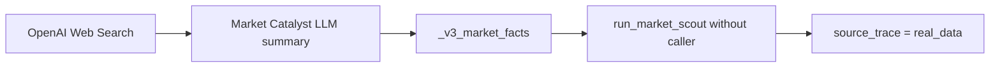

# V3 Cross-Agent Fake-AI Audit

## Remediation Status - 2026-06-12

The findings below preserve the audited pre-remediation behavior. Current status:

| Finding | Status |
|---|---|
| FAI-01 Market Scout source laundering | Fixed with inherited field provenance and conservative fallback |
| FAI-02 Trade Execution mixed-source laundering | Fixed at layer/leaf trace level; unknown fields remain fallback |
| FAI-03 Public Equity conclusions without required data | Contained by data-sufficiency gates and hypothesis fields |
| Missing production `peer_snapshot.metrics` | Partially fixed using verified peer quote returns only |
| WANG unsupported numeric precision | Contained by sufficiency gates and hypothesis-only retention |
| News string-to-fact loss | Fixed with structured fact preservation and legacy compatibility |

The validator now includes semantic checks (`V3-SEM-001` through `V3-SEM-005`) rather than checking source enums alone.

审计日期：2026-06-12

## Definition

本审计把以下情况定义为 Fake-AI 风险：

1. 规则或模板产物被展示为 AI 结论。
2. LLM 在没有所需事实时仍被要求输出评级、比例或量化判断。
3. 二次 LLM 摘要被标成 `real_data`。
4. 混合了真实数据、规则和 LLM 的对象被统一标成真实数据。
5. 字段非空被错误当成来源可靠。

## P0 Findings

### FAI-01 Market Scout 来源洗白



证据：

- Web LLM 生成 Market Catalyst：`workbench_news.py:20-29`
- V3 主链没有传 `market_scout_caller`：`visual_report.py:379-387`
- 无 caller 时固定使用 `source="real_data"`：`v3_market_scout.py:30-35`

结论：Market Scout 并没有把 Web 摘要变成真实数据，只是重新包装了它。

### FAI-02 Trade Execution 混合来源洗白

Trade Execution 包含三类内容：

- `real_data`：交易记录、个股/指数/板块价格
- `hardcode`：固定阈值、固定同行 proxy score 和文案
- `llm`：默认开启的 execution LLM 增强

但 `v3_pipeline.py:102-105,145-150` 把整个层和所有叶子统一标为 `real_data`。

这会直接污染：

- `answer_evidence.mistake_diagnosis`
- `ai_final_answer.mistake_source`
- `ai_final_answer.next_action`
- `ai_final_answer.score`

### FAI-03 Public Equity 无财务数据却输出财务/估值结论

输入财务全部 pending/None：`workbench_context.py:58-65`。

Agent 不上网：`workbench_agents.py:706-718`。

Prompt 仍要求评级、财务验证、估值赔率：`workbench_agents.py:787-824`。

因此：

```text
没有财报/估值数据
  -> Prompt 要求必须输出
  -> LLM 生成貌似专业的财务/估值文本
  -> source_trace = llm
```

`llm` 标注在技术上说明生成方式，但不足以说明“未被数据验证”。当前枚举无法表达
`llm_without_required_data`。

## P1 Findings

### FAI-04 WANG 的量化外观没有量化数据

WANG Prompt 要求：

- 利润池占比
- 公司/行业壁垒分
- 逻辑确定性百分比
- 同行排名

证据：`workbench_agents.py:744-780`。

上游只有行情摘要、交易事实和催化剂摘要，没有利润池、壁垒样本或同行财务。
这些字段是 LLM 估计值，不应以图表化精确数字呈现。

### FAI-05 Trade Execution “同行推荐”是规则代理

`trade_execution_agent.py:251-327` 生成同行推荐：

- 行情加权
- 固定 proxy score
- 固定 moat/profit 文案

它不是 Better Opportunity Agent，也不是基于真实基本面比较。
Frontend 仍可把它展示为“同行强者观察”：
`frontend/app/review/report/[id]/page.tsx:922-960,1206-1221`。

### FAI-06 Source trace 由容器非空推断

`v3_pipeline.py:93-123` 使用“对象非空”决定整个层来源：

- WANG 非空 -> `llm`
- Public 非空 -> `llm`
- Execution 非空 -> `real_data`
- Market Scout 有任意字段 -> `real_data`

这不是数据血缘，只是 output-presence classification。它没有追踪：

- 字段是原始事实还是摘要
- 是否来自 fallback cache
- 是否经过规则
- 是否经过 LLM 覆写
- 是否缺少结论所必需的数据

### FAI-07 最终字段统一标 LLM，丢失证据组成

Coach 成功后，六个最终字段统一标 `llm`：
`v3_trade_coach_agent.py:181-196`。

这说明“最后由 LLM 写出”，但没有说明：

- `score` 使用了哪些真实字段
- `mistake_source` 是否主要来自规则判断
- `better_choice` 使用了哪些同行指标
- `main_reason` 是否依赖无财务支持的 Public 结论

LLM 是最后加工者，不是原始数据来源。

## Presenter/Frontend Audit

正向变化：

- Presenter 已透传 `ai_final_answer` 和 `source_trace`：
  `presenter_agent.py:159-166`
- 未生成评分时 Frontend 显示“尚未生成”：
  `frontend/app/review/report/[id]/page.tsx:371-375`
- 研究层默认折叠：
  `frontend/app/review/report/[id]/page.tsx:458-471`

剩余风险：

- Frontend 没有在答案卡旁展示 `source_trace`
- legacy evidence 可回填答案依据，虽标“旧版报告依据”，但仍可能来自无数据 LLM：
  `page.tsx:329-343,390-444`
- Presenter 继续创建大量“待验证”表达文案；这不构成伪结论，但来源没有逐字段展示

## Field-Level Fake-AI Classification

| 字段 | 当前实际生成方式 | 当前 trace | 审计判断 |
|---|---|---|---|
| `ai_final_answer.score` | Coach LLM 综合混合输入 | `llm` | 证据不可分解 |
| `verdict` | Coach LLM | `llm` | 可能依赖无财务 Public 结论 |
| `better_choice` | Better LLM 候选 + Coach 复述 | `llm` | 生产中预计常 missing |
| `main_reason` | Coach LLM | `llm` | 无字段级引用 |
| `mistake_source` | Coach LLM，输入含规则/LLM Execution | `llm` | 混合来源未披露 |
| `next_action` | Coach LLM | `llm` | 可能重述硬编码规则 |
| `why_stock_moved` | 旧 Web LLM 摘要经 Market Scout 包装 | `real_data` | **误标** |
| `profit_flow` | WANG LLM | `llm` | 无利润池数据 |
| `moat_radar` | WANG LLM | `llm` | 无评分样本 |
| `financial_validation` | Public LLM | `llm` | 无财报输入 |
| `valuation_odds` | Public LLM | `llm` | 无估值输入 |
| Execution quote fields | 行情 | `real_data` | 正确，但 fallback 未区分 |
| Execution judgments | 规则/LLM | `real_data` | **误标** |
| Execution peer moat reason | 硬编码 | `real_data` | **误标** |

## Risk Ranking

1. **P0**：Market Scout 把 LLM Web 摘要标成真实数据。
2. **P0**：Trade Execution 规则、硬编码和 LLM 叶子全部标成真实数据。
3. **P0**：Public Equity 在零财务/估值输入下仍输出投资判断。
4. **P1**：WANG 数字图表是 Prompt 强制的模型估计，不是量化研究。
5. **P1**：最终答案只有“最后生成者”血缘，没有原始证据血缘。
6. **P1**：Frontend 不展示来源，用户无法看到上述差异。
7. **P2**：Presenter 的待验证模板仍会让页面显得完整，但已不再制造默认评分。

## Audit Verdict

当前 Validator 通过只证明：

- 字段存在
- source 枚举合法
- 没有默认 B/50

它不能证明 source 标得正确。当前系统已经从“明显硬编码伪 AI”进步到
“结构合规但语义血缘不可信”的阶段。
