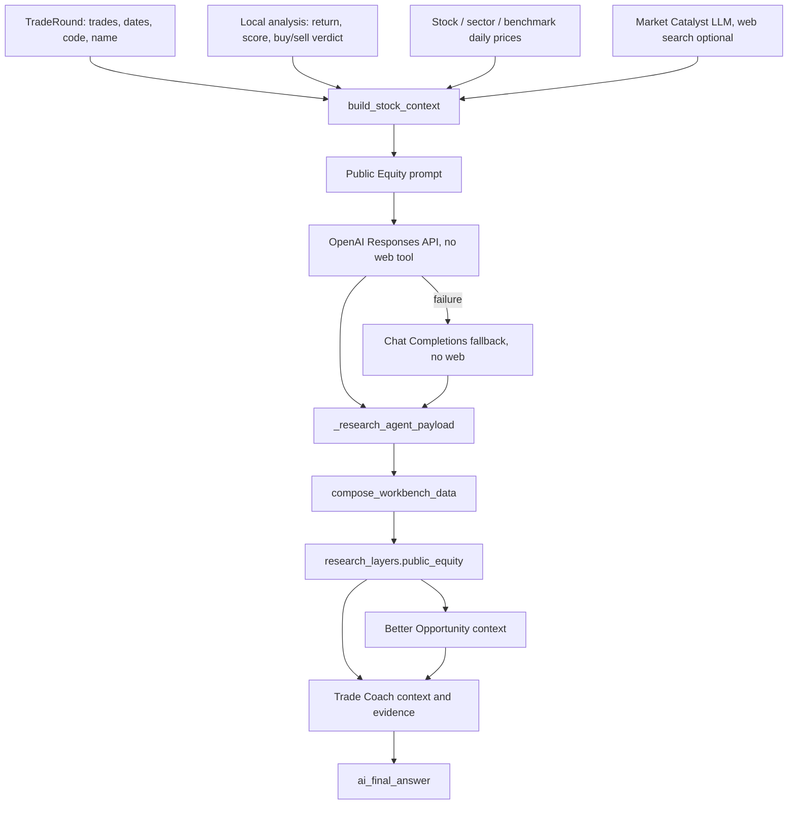
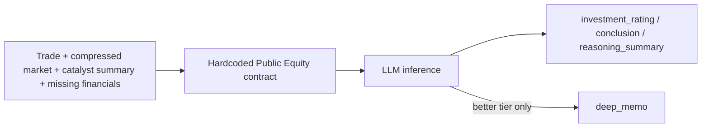
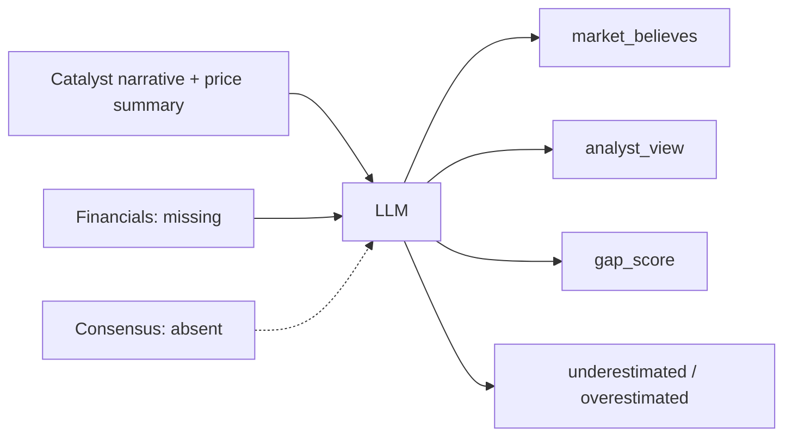
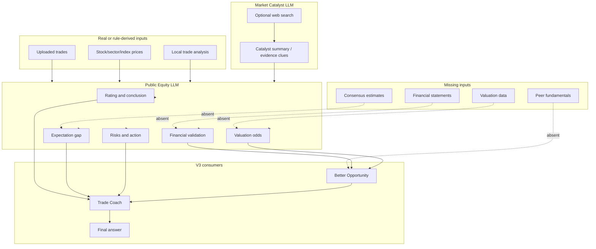

# Public Equity Agent Architecture Audit

## 0. Audit Scope and Executive Conclusion

Audit target: the current `feat/v3-schema` implementation of Public Equity Agent and the V3 consumers of its output.

This is an architecture and data-lineage audit, not a bug review and not a product implementation.

Primary evidence:

- `trade_review_agent/workbench_context.py`
- `trade_review_agent/workbench_news.py`
- `trade_review_agent/workbench_agents.py`
- `trade_review_agent/industry_agent.py`
- `trade_review_agent/workbench_composer.py`
- `trade_review_agent/v3_better_opportunity_agent.py`
- `trade_review_agent/v3_trade_coach_agent.py`
- `trade_review_agent/v3_pipeline.py`
- `trade_review_agent/visual_report.py`

### Executive conclusion

Public Equity is a real LLM call, but it is not yet a data-complete public-equity research agent.

It receives:

- real trade records and locally calculated trade judgments;
- real but heavily compressed stock/sector/index price performance;
- a market-catalyst package produced by another LLM, which may use web search;
- company code and name.

It does **not** receive:

- financial statements or financial time series;
- PE/PB/EV/EBITDA, valuation percentile, or market-cap data;
- sell-side consensus, earnings forecasts, or estimate revisions;
- structured peer fundamentals or peer valuation;
- ownership, cash-flow quality, balance-sheet, or segment data.

Nevertheless, its prompt requires investment rating, financial validation, valuation odds, expectation gap, position sizing, and action. Those fields are therefore mainly LLM hypotheses generated from a template, not conclusions derived from the data their labels imply.

The V3 Trade Coach consumes Public Equity directly. It uses the rating and expectation gap as investment-thesis evidence, and risks as mistake-diagnosis evidence. Because the coach only checks that either WANG or Public Equity is non-empty, a polished but weakly grounded Public Equity result can help unlock a final V3 score and verdict.

## 1. Runtime Path



Evidence:

- Context construction: `workbench_context.py:13-75`.
- Public Equity execution: `workbench_agents.py:706-727`.
- Public Equity is called in parallel with WANG: `industry_agent.py:102-112`.
- V3 join: `visual_report.py:362-422`.
- Better Opportunity consumption: `v3_better_opportunity_agent.py:34-58`.
- Trade Coach consumption: `v3_trade_coach_agent.py:40-112`.

### Important runtime-definition finding

`workbench_agents.py` defines `run_public_equity_workbench_agent` twice:

- early definition: `workbench_agents.py:27-35`;
- effective final definition: `workbench_agents.py:706-727`.

Python uses the final definition. The earlier text-memo implementation is dead at runtime. The current effective path is the structured JSON research path.

## 2. Actual Inputs and Their Sources

| Input path | Immediate source | Underlying source | Actually used by Public Equity | Quality |
|---|---|---|---|---|
| `company.code` | `build_stock_context` | uploaded trade/security identity | Yes, inside full JSON prompt | Real data |
| `company.name` | `build_stock_context` | uploaded trade/security identity | Yes | Real data |
| `company.market` | hardcoded `"A-share"` | template | Yes | Hardcode |
| `trade.buy_date/sell_date` | `TradeRound` | uploaded trades | Yes | Real data |
| `trade.return_pct` | local `analysis` | price/trade calculation | Yes | Real derived data |
| `trade.trade_score/rating` | local `analysis` | rule-based trade review | Yes | Rule-derived |
| `trade.system_buy_verdict` | local `optimal` analysis | rule-based trade review | Yes | Rule-derived |
| `trade.system_sell_verdict` | local `optimal` analysis | rule-based trade review | Yes | Rule-derived |
| `trade.trades` | `TradeRound.trades` | uploaded trades | Yes, max 12 records | Real data |
| `market.stock_pct_on_buy_day` | local `analysis` | stock prices | Yes | Real derived data |
| `market.sector_pct_on_buy_day` | local `analysis` | sector proxy prices | Yes | Real derived data |
| `market.benchmark_pct_on_buy_day` | local `analysis` | benchmark prices | Yes | Real derived data |
| `market.recent_stock_performance` | `_frame_snapshot` | last 20 stock closes | Yes, as one text sentence | Real but compressed |
| `market.recent_sector_performance` | `_frame_snapshot` | last 20 sector closes | Yes, as one text sentence | Real but compressed |
| `market.recent_benchmark_performance` | `_frame_snapshot` | last 20 benchmark closes | Yes, as one text sentence | Real but compressed |
| `financials.revenue_growth` | literal `"pending fetch"` | none | Present in prompt, unusable | Missing/hardcoded marker |
| `financials.profit_growth` | literal `"pending fetch"` | none | Present in prompt, unusable | Missing/hardcoded marker |
| `financials.gross_margin` | literal `"pending fetch"` | none | Present in prompt, unusable | Missing/hardcoded marker |
| `financials.valuation` | literal `"pending fetch"` | none | Present in prompt, unusable | Missing/hardcoded marker |
| `financials.pe_ttm` | `None` | none | Present in prompt, unusable | Missing |
| `financials.pb` | `None` | none | Present in prompt, unusable | Missing |
| `market_catalyst.*` | Market Catalyst LLM | web results when enabled, otherwise fallback | Yes | LLM summary, not raw evidence |
| `recent_catalysts` | copied from Market Catalyst | same as above | Yes | LLM/fallback |
| `market_hype_reason` | copied from Market Catalyst | same as above | Yes | LLM/fallback |
| `traded_business_line` | copied from Market Catalyst | same as above | Yes | LLM/fallback |
| `what_market_is_pricing` | copied from Market Catalyst | same as above | Yes | LLM/fallback |
| `evidence_quality` | copied from Market Catalyst | LLM classification | Yes | LLM |
| `unknowns` | copied from Market Catalyst | LLM/fallback | Yes | LLM/fallback |
| `evidence` | copied from Market Catalyst | short LLM summaries/source clues | Yes | LLM summary |
| `news` | duplicates `recent_catalysts` | Market Catalyst output | Yes | Not an independent news feed |
| `wang_pre_read` | helper exists only | would come from WANG | No in current flow | Dead path |
| structured peers | none | none | No | Missing |

Evidence:

- Trade, market, financial placeholders, catalyst copy: `workbench_context.py:24-75`.
- Price snapshot reduces each series to one 20-day return sentence: `workbench_context.py:78-87`.
- `_number` converts unavailable numeric values to `0.0`, which can blur missing versus true zero: `workbench_context.py:96-100`.
- Market Catalyst may call web search: `workbench_news.py:20-29`.
- Market Catalyst fallback: `workbench_news.py:108-118`.
- Public Equity itself explicitly calls `_call_json_agent(... allow_web=False)`: `workbench_agents.py:706-718`.
- A WANG pre-read helper exists: `industry_agent.py:208-226`.
- Actual orchestration submits WANG and Public Equity concurrently with the same context, so the helper is not called: `industry_agent.py:102-112`.

### Does it really use market, financial, peer, and news data?

| Data category | Verdict | Explanation |
|---|---|---|
| Market prices | **Yes, shallowly** | It receives buy-day relative moves and one 20-day return sentence for stock, sector, and benchmark. It does not receive OHLCV, volatility, drawdown, turnover, or regime features. |
| Financial data | **No** | Every named financial input is a placeholder or `None`. |
| Peer data | **No** | Public Equity receives no structured peer set or comparable metrics. |
| News/catalysts | **Indirectly** | A separate Market Catalyst LLM may browse the web, then sends summarized text. Public Equity itself has web disabled and receives neither guaranteed URLs nor raw documents. |
| WANG output | **No, current path** | Both agents run in parallel. `_context_with_wang_pre_read` is unused. |

## A. Field Generation Chain

All business fields below are demanded by a hardcoded prompt contract at `workbench_agents.py:784-824`. The LLM response is not recomputed or substantively validated; the wrapper adds metadata and removes memo fields in standard mode at `workbench_agents.py:837-865`.

### A1. Core conclusion fields

| Output field | Generation chain | Mechanism | Data adequacy | Empty/invalid likelihood |
|---|---|---|---|---|
| `investment_rating` | context -> prompt enum `A+/A/B/C` -> LLM JSON | LLM constrained by hardcoded enum | Low: no financial/valuation model | Medium. Required by prompt but not schema-validated; malformed/omitted output is accepted if some other research field exists. |
| `one_sentence_conclusion` | full context -> LLM narrative | LLM | Low-medium: trade and catalyst context exist, fundamentals do not | Medium. Prompt-required, but wrapper does not enforce presence. |
| `reasoning_summary` | full context -> <=180-char LLM summary | LLM/template | Same as underlying fields | Medium. Required by prompt, not validated. |
| `deep_memo` | full context -> 700-1000 character LLM memo | LLM/template, better tier only | Same as underlying fields | Guaranteed absent in standard tier because wrapper removes it. In better tier, medium omission/truncation risk. |

Lineage:



Evidence: prompt fields at `workbench_agents.py:787-824`; tier behavior at `workbench_agents.py:706-727` and `workbench_agents.py:827-865`.

### A2. Market narrative fields

| Output field | Generation chain | Mechanism | Actual source | Empty likelihood |
|---|---|---|---|---|
| `market_hype_reason` | Market Catalyst LLM summary + market snapshot -> Public Equity LLM rewrite | LLM-on-LLM | Indirect web/LLM or fallback | Low-medium; fallback language can be rewritten into polished prose. |
| `recent_catalysts[]` | Market Catalyst recent catalysts -> Public Equity LLM selection/rewrite | LLM-on-LLM | Indirect web/LLM | Medium-high when search fails or evidence is weak. |
| `traded_business_line` | Market Catalyst inference -> Public Equity LLM inference | LLM-on-LLM | No segment revenue verification | Medium. |
| `what_market_is_pricing` | catalyst narrative + price summaries -> LLM inference | LLM | No consensus/positioning data | Medium; semantic content may exist while factual support is weak. |
| `evidence_quality` | Market Catalyst quality label -> Public Equity LLM label | LLM classification | No deterministic rubric | Low empty probability, high subjectivity. |
| `unknowns[]` | Market Catalyst unknowns + LLM synthesis | LLM | Disclosure field | Medium. |

The composer prioritizes Public Equity for `traded_business_line` and `what_market_is_pricing`, ahead of WANG and the Market Catalyst context: `workbench_composer.py:27-36`.

### A3. Expectation-gap fields

| Output field | Generation chain | Mechanism | Missing required data | Empty likelihood |
|---|---|---|---|---|
| `expectation_gap.market_believes[]` | context -> LLM invents/synthesizes market beliefs | LLM | consensus forecasts, sell-side estimates, positioning, estimate revisions | Medium |
| `expectation_gap.analyst_view[]` | context -> LLM creates an analyst view | LLM persona/template | actual analyst model or estimates | Medium |
| `expectation_gap.gap_score` | prompt example `0` -> LLM chooses number | LLM numeric judgment | formula, baseline, calibration | Medium empty; high arbitrary-number risk |
| `expectation_gap.underestimated` | context -> LLM narrative | LLM | quantified expectation baseline | Medium |
| `expectation_gap.overestimated` | context -> LLM narrative | LLM | quantified expectation baseline | Medium |

Lineage:



This is a major fake-precision area: `gap_score` looks quantitative, but there is no formula or measurable expectation baseline.

### A4. Validation, financial, and valuation fields

| Output field | Generation chain | Mechanism | Audit classification | Empty likelihood |
|---|---|---|---|---|
| `validation_panel[]` | missing financial placeholders + catalyst summary -> LLM list | LLM/template | Often a checklist or hypothesis, not validation | Medium |
| `financial_validation[]` | `"pending fetch"`/`None` financial block -> LLM list | LLM without financial data | **High-risk pseudo-validation** | Medium; populated values are more dangerous than empty ones |
| `valuation_odds` | `valuation="pending fetch"`, `pe_ttm=None`, `pb=None` -> LLM prose | LLM without valuation data | **High-risk pseudo-valuation** | Medium; populated prose is unsupported |
| `sources[]` | context evidence/news + prompt request -> LLM strings | LLM | No URL/citation validation | Medium-high |

The composer correctly records warnings in source-trace details:

- no structured financial statements: `workbench_composer.py:295-298`;
- no PE/PB or valuation percentile: `workbench_composer.py:299-302`.

However, the source is still labeled `llm` whenever the field is non-empty. The trace does not encode that the LLM had no underlying financial data.

### A5. Catalysts, risks, and action fields

| Output field | Generation chain | Mechanism | Data dependency | Empty likelihood |
|---|---|---|---|---|
| `catalysts[].time` | catalyst package -> LLM | LLM/template | Indirect news summary; dates not guaranteed | Medium-high |
| `catalysts[].event` | catalyst package -> LLM | LLM | Indirect news summary | Medium |
| `catalysts[].impact` | event -> LLM `高/中/低` | LLM classification | No impact model | Medium |
| `risks[].name` | full context -> LLM | LLM | Generic and company-specific inference | Low-medium |
| `risks[].why_it_matters` | risk -> LLM | LLM | Narrative | Low-medium |
| `risks[].impact_pct` | prompt numeric slot -> LLM | LLM numeric judgment | No scenario/earnings model | Medium; high fake-precision risk |
| `risks[].downgrade_action` | risk -> LLM | LLM/template | No portfolio policy | Medium |
| `action.status_tags[]` | full context -> LLM | LLM constrained by examples | No deterministic classification | Medium |
| `action.current_action` | rating/risk narrative -> LLM | LLM recommendation | No suitability/risk model | Medium |
| `action.suitable_for` | narrative -> LLM | LLM | No user profile | Medium |
| `action.not_suitable_for` | narrative -> LLM | LLM | No user profile | Medium |
| `action.recheck_conditions[]` | narrative -> LLM | LLM | Useful as hypotheses | Medium |
| `position_sizing` | trade context + LLM judgment | LLM recommendation | No portfolio value, volatility budget, user risk, or liquidity model | Medium-high |
| `trading_implication` | trade outcome and local buy/sell verdict -> LLM | LLM | This is the best-supported action field | Medium |

### A6. Wrapper and metadata fields

| Output field | Generator | Mechanism | Evidence |
|---|---|---|---|
| `agent_type="public_equity"` | `_research_agent_payload` | hardcode | `workbench_agents.py:853` |
| `model` | research tier/env resolution | rule/config | `workbench_agents.py:232-264`, `853-855` |
| `research_model_tier` | normalized context setting | rule/config | `workbench_agents.py:246-268`, `855` |
| `research_output_mode` | tier flag | rule | `workbench_agents.py:856` |
| `research_metrics` | timer, character count, token estimate/API usage | rule/real metadata | `workbench_agents.py:857`, `868-892` |
| `memo/raw_text` aliases | copied from `deep_memo` in better tier | rule | `workbench_agents.py:858-865` |

## 3. How V3 Consumes Public Equity

### 3.1 Better Opportunity Agent

Public Equity contributes only:

- `quality_rating` from `quality_rating` or `investment_rating`;
- `financial_validation`;
- `valuation_odds`;
- `risk_score`;
- `risks`.

Evidence: `v3_better_opportunity_agent.py:51-57`.

The Better Opportunity Agent cannot run unless Market Scout provides a non-target peer with a non-empty `metrics` dictionary and some industry context: `v3_better_opportunity_agent.py:61-90`.

Current production market facts do not construct peer metrics. `_v3_market_facts` only forwards `peer_snapshot` if it already exists in the catalyst/workbench layer: `visual_report.py:425-445`. The legacy Market Catalyst contract does not produce `peer_snapshot`: `workbench_news.py:73-83`.

Therefore, in the normal current chain:

```text
peer_snapshot absent
  -> Better Opportunity status=missing
  -> Public Equity financial_validation/valuation_odds are not enough to select a peer
  -> better_choice remains missing
```

This fail-closed behavior is good. It prevents Public Equity's unsupported valuation prose from independently generating a replacement stock.

### 3.2 Trade Coach Agent

Public Equity is consumed in three direct ways:

1. `investment_thesis.quality_rating`
   - `quality_rating` or `investment_rating`
   - evidence: `v3_trade_coach_agent.py:90-97`.

2. `investment_thesis.expectation_gap`
   - direct pass-through of Public Equity's object
   - evidence: `v3_trade_coach_agent.py:95-97`.

3. `mistake_diagnosis.research_risks`
   - direct pass-through of Public Equity's risks
   - evidence: `v3_trade_coach_agent.py:101-110`.

The complete Public Equity object is also included in the Trade Coach prompt context: `v3_trade_coach_agent.py:40-54`, `232-247`.

The sufficiency gate only requires:

- usable trade-execution judgment; and
- at least one non-empty WANG or Public Equity object.

Evidence: `v3_trade_coach_agent.py:57-75`.

It does **not** require:

- real financial evidence;
- real valuation evidence;
- high evidence quality;
- non-fallback news;
- field-level source confidence.

As a result, Public Equity can materially influence:

- `ai_final_answer.score`;
- `verdict`;
- `main_reason`;
- `mistake_source`;
- `next_action`;

even when its most important investment fields were generated without financial or valuation inputs.

The final answer is generated by another LLM, with all six fields labeled simply `source=llm`: `v3_trade_coach_agent.py:181-196`. This loses mixed lineage: the final LLM may be reasoning over real trades, rule-derived execution, LLM catalyst summaries, and unsupported Public Equity hypotheses simultaneously.

## B. Coverage Audit

### B1. Cross-industry coverage

The Public Equity prompt is generic and contains no explicit industry branches. It can syntactically run for any A-share company. That is broad **language coverage**, not broad **research coverage**.

| Industry group | Required specialist data absent | Resulting weakness | Coverage rating |
|---|---|---|---|
| Banks | NIM, NPL ratio, provision coverage, CET1, deposit structure | Cannot evaluate asset quality or earnings durability | Very low |
| Insurers | NBV, embedded value, solvency, investment yield | Cannot validate valuation or growth | Very low |
| Brokers | trading/investment income mix, AUM, capital usage | Generic cycle narrative only | Low |
| Property | contracted sales, land bank, net gearing, cash collection | Cannot distinguish liquidity and project quality | Very low |
| Biotech/pharma | pipeline stage, trial endpoints, patents, probability-adjusted NPV | Catalyst and valuation conclusions are unsafe | Very low |
| SaaS/software | ARR, retention, billings, deferred revenue, SBC | No unit economics or quality validation | Very low |
| Semiconductors | product mix, utilization, yield, node, inventory cycle, capex | WANG narrative may help, Public Equity validation remains shallow | Low |
| Industrials/manufacturing | order backlog, utilization, ASP, raw materials, working capital | Cannot validate operating leverage | Low |
| Consumer | same-store sales, volume/price/mix, channel inventory, store productivity | Cannot distinguish brand quality from theme | Low |
| Commodities | production volume, realized price, cost curve, reserves | Cannot calculate earnings sensitivity | Very low |
| Utilities | capacity, utilization hours, tariff, fuel cost, capex/regulated returns | No cash-flow or policy economics | Low |
| Internet/platform | MAU, monetization, take rate, cohort behavior, regulation | Generic quality language only | Low |

### B2. Hidden coverage bias

The news query template contains a fixed list of themes:

`电容 AI 机器人 新能源`

Evidence: `workbench_news.py:51-55`.

This is not a formal industry branch, but it introduces search bias toward a small set of technology/growth themes. Companies outside these themes may receive less relevant catalyst retrieval.

The query year is also hardcoded to `2026`: `workbench_news.py:52-55`. This will become stale and harms historical/replay analysis because the query is not anchored to the trade date.

### B3. Historical coverage

Market Catalyst queries search for “recent” 2026 information, while the trade may have occurred earlier. Public Equity can therefore mix current narratives with historical trade review. The context includes trade dates, but the web query builder does not use them.

Coverage risk: a historical trade can be judged using information not available at the original decision date.

### B4. Output completeness

There is no field-level contract validator for Public Equity. `_research_payload_present` accepts the payload if any one among several broad fields is present: `industry_agent.py:153-166`.

Consequences:

- partial JSON can pass;
- required prompt fields may be absent;
- standard tier always omits `deep_memo`;
- API truncation or JSON repair can silently yield incomplete objects;
- downstream consumers must tolerate missing fields.

## C. Hardcode Audit

| Hardcode/template | Location | Risk |
|---|---|---|
| Standard model default `gpt-4.1` | `workbench_agents.py:12`, `232-264` | Operational default, low architectural risk |
| Better model default `gpt-5.5` | `workbench_agents.py:13`, `236-264` | May be invalid/unavailable depending on API account; operational risk |
| Company market `"A-share"` | `workbench_context.py:35-39` | Scope hardcode; unsuitable for non-A-share expansion |
| Financial values `"pending fetch"` and `None` | `workbench_context.py:58-65` | High risk because prompt still requests financial conclusions |
| Rating enum `A+/A/B/C` | `workbench_agents.py:787-790` | Template-induced pseudo-standardization; no scoring rubric |
| Gap score example `0` | `workbench_agents.py:797-803` | Encourages uncalibrated numeric output |
| Risk `impact_pct: 0` | `workbench_agents.py:804-806` | Encourages fake precision without scenario model |
| Action menu | `workbench_agents.py:807-813` | LLM selects advice from template without portfolio policy |
| Memo length 700-1000 chars | `workbench_agents.py:730-735`, `784-824` | Presentation requirement, not reasoning quality |
| Output token defaults 1400/3200 | `workbench_agents.py:827-834` | Can create truncation risk for large contract |
| Market Catalyst query year `2026` | `workbench_news.py:51-55` | Stale-date and look-ahead risk |
| Theme terms `电容/AI/机器人/新能源` | `workbench_news.py:53` | Industry/search coverage bias |
| Catalyst fallback phrases | `workbench_news.py:108-118` | Safe when retained, risky if downstream LLM rewrites them as conclusions |
| V3 LLM token limit `2200` | `visual_report.py:448-458` | Operational truncation risk |
| V3 enabled by default | `visual_report.py:463-465` | Final conclusions run unless explicitly disabled |

No current hardcoded default `B/50` is present in the audited Public Equity path. The more important remaining hardcode problem is that the prompt requires a complete-looking investment framework despite hardcoded missing financial inputs.

## D. Fake-AI Audit

“Fake AI” here means output that appears to be evidence-based AI research but is actually a rule/template, an unsupported LLM completion, or a fallback disguised as analysis.

### D1. Real AI versus fake-AI classification

| Area | Classification | Reason |
|---|---|---|
| OpenAI call | Real LLM | The effective agent calls Responses API and falls back to Chat Completions. |
| Investment rating | LLM, weakly grounded | Real model inference, but no scoring rubric or fundamental data. |
| Financial validation | **Pseudo-research / fake validation risk** | Field name claims validation while financial inputs are missing. |
| Valuation odds | **Pseudo-research / fake valuation risk** | No valuation data enters the model. |
| Expectation gap | **Pseudo-research risk** | No consensus or estimate data. |
| `gap_score` | **Fake precision** | LLM-generated number with no formula/calibration. |
| `risks[].impact_pct` | **Fake precision** | No earnings/scenario model. |
| Position sizing | **Pseudo-personalized advice risk** | No portfolio, liquidity, volatility, or user suitability data. |
| Sources | **Citation appearance risk** | LLM strings are not validated as citations or URLs. |
| Market/news use | LLM-on-LLM | Public Equity consumes a summarized Market Catalyst output, not verified source documents. |
| Source trace | Partially truthful | Correctly labels LLM generation, but does not distinguish LLM with real fundamentals from LLM without them. |

### D2. Prompt/template masquerading as research

The output looks complete because the prompt explicitly enumerates professional research sections. Completeness is prompt-driven:

```text
rating
expectation gap
validation panel
catalysts
risks
action
financial validation
valuation odds
position sizing
trading implication
```

The architecture does not independently prove that the required evidence exists before asking the LLM to fill those sections.

### D3. Fallback laundering

Market Catalyst safely falls back to “待验证” and empty evidence. Public Equity then receives those fallback markers inside a broad instruction to produce every conclusion field. There is no deterministic guard preventing the LLM from turning weak fallback context into:

- a non-empty rating;
- a valuation paragraph;
- financial-validation bullets;
- action advice.

This is fallback laundering: missing upstream data can emerge as polished downstream analysis.

### D4. Source-trace overstatement

Composer trace assigns every non-empty Public Equity leaf the same `llm` source: `workbench_composer.py:289-302`, `306-326`.

V3 pipeline repeats the same behavior: every Public Equity leaf is marked `llm`: `v3_pipeline.py:133-144`.

This is technically true about the immediate generator, but insufficient for architecture audit. It hides whether the LLM relied on:

- real market data;
- LLM-summarized web data;
- rule-derived trade labels;
- hardcoded missing placeholders;
- no supporting data at all.

## E. Risk Ranking

| Rank | Risk | Severity | Probability | Affected outputs |
|---:|---|---|---|---|
| 1 | Financial and valuation conclusions generated without financial/valuation data | Critical | High | `investment_rating`, `financial_validation`, `valuation_odds`, `validation_panel`, `action` |
| 2 | Trade Coach can use weak Public Equity output to generate final score/verdict | Critical | High | all `ai_final_answer` fields |
| 3 | Expectation-gap analysis lacks consensus/estimate data | High | High | entire `expectation_gap`, especially `gap_score` |
| 4 | Source trace says only `llm`, losing underlying evidence lineage and confidence | High | Certain | all Public Equity leaves and downstream evidence |
| 5 | Current-news query can introduce look-ahead bias into historical trade review | High | Medium-high | catalysts, pricing narrative, conclusion, coach verdict |
| 6 | Public Equity receives no structured peers; company quality is not comparative | High | High | rating, valuation odds, better-choice context |
| 7 | Numeric `gap_score` and `risk.impact_pct` create fake precision | High | High | expectation gap and risks |
| 8 | Position-sizing/action advice lacks user and portfolio risk inputs | High | Medium-high | `position_sizing`, `action.current_action` |
| 9 | LLM-on-LLM news pipeline can amplify unsupported summaries | Medium-high | Medium | hype reason, catalysts, market pricing |
| 10 | Broad prompt masks low specialist-industry coverage | Medium-high | High | quality, financial validation, valuation |
| 11 | Partial payloads pass because there is no Public Equity field validator | Medium | Medium | any requested field |
| 12 | Duplicate/dead Public Equity definitions obscure the effective architecture | Medium | Certain | maintainability and auditability |
| 13 | Search query has fixed technology-theme terms and fixed year | Medium | High | catalyst coverage |
| 14 | Missing numeric values can become `0.0` in context normalization | Medium | Medium | trade/market facts when upstream values are absent |

## 4. Field-Level Data Lineage Summary



## 5. Audit Verdict

Public Equity is not a rules engine pretending to call AI; it genuinely calls an LLM. The architectural problem is subtler and more serious:

**the LLM is asked to produce conclusions whose required evidence is absent.**

The most defensible current outputs are:

- trade implication based on actual trade context;
- high-level catalyst/risk hypotheses clearly marked for verification;
- unknowns and recheck conditions.

The least defensible outputs are:

- financial validation;
- valuation odds;
- expectation-gap score;
- risk impact percentages;
- position sizing;
- any final Trade Coach score/verdict that treats these fields as verified evidence.

The current Better Opportunity fail-closed gate is a strong design choice. The Trade Coach sufficiency gate is not equally strict and remains the primary downstream architectural risk.

## 6. Files Changed by This Audit

- `docs/v3_audit/public_equity_agent_audit.md`
