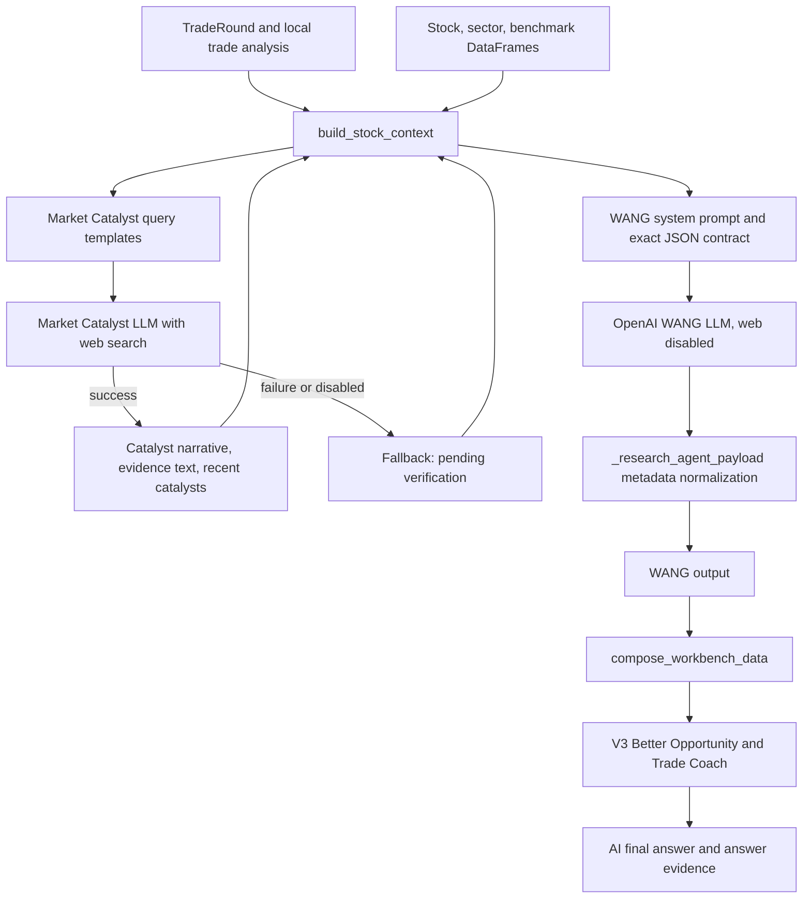

# WANG Agent Architecture Audit

## Remediation Status - 2026-06-12

The audit findings below preserve the behavior observed before remediation.

- Unsupported profit shares, moat scores, industry averages, dimension scores, certainty percentages, and peer rankings are now withheld from formal fields when their required structured inputs are absent.
- Original LLM values are retained only in explicit `*_hypothesis` fields.
- WANG now exposes deterministic `data_sufficiency` and field-level provenance.
- Semantic validator rules `V3-SEM-006` through `V3-SEM-009` reject reintroduction of unsupported formal numbers.
- Still open: actual profit-pool data, peer moat samples, probability calibration, industry KPI adapters, and verified peer fundamentals.

## 0. Audit Scope And Verdict

Audit target: current `feat/v3-schema` runtime code, not the previous audit document.

Primary runtime path:

```text
TradeRound + local analysis + stock/sector/benchmark frames
  -> build_stock_context()
  -> build_market_catalyst_context() [web-enabled LLM, may fallback]
  -> run_wang_workbench_agent() [OpenAI LLM, web disabled]
  -> _research_agent_payload() [metadata only]
  -> compose_workbench_data()
  -> _join_v3_pipeline()
  -> Better Opportunity + Trade Coach
```

Overall conclusion:

- WANG is a real LLM call, not a deterministic rules engine pretending to be AI.
- However, most high-value WANG outputs are unsupported LLM judgments because the input contains no structured financial statements, valuation data, industry supply/demand data, capacity data, customer data, or verified peer metrics.
- WANG itself does not browse the web. It consumes a compact upstream Market Catalyst result that may have used web search.
- Numeric-looking fields such as profit shares, moat scores, and certainty percentages are requested by the prompt but are not computed from numeric source data. They are the highest fake-precision risk.
- V3 consumes WANG in Better Opportunity, Trade Coach, evidence, and final answers. Therefore unsupported WANG judgments can propagate into user-facing conclusions.
- Current `source_trace` says WANG leaves are `llm`, but does not identify which input fact supports each field. This is model-origin lineage, not evidence lineage.

Key evidence:

- Context construction: `trade_review_agent/workbench_context.py:13-75`
- Financial placeholders: `trade_review_agent/workbench_context.py:58-65`
- Market Catalyst web call/fallback: `trade_review_agent/workbench_news.py:11-34`
- WANG active runtime call with web disabled: `trade_review_agent/workbench_agents.py:682-703`
- WANG active output contract: `trade_review_agent/workbench_agents.py:744-781`
- LLM API and API-key requirement: `trade_review_agent/workbench_agents.py:153-180`
- Composer propagation: `trade_review_agent/workbench_composer.py:11-144`
- V3 consumption: `trade_review_agent/v3_pipeline.py:10-55`
- Better Opportunity WANG inputs: `trade_review_agent/v3_better_opportunity_agent.py:34-58`
- Trade Coach WANG inputs: `trade_review_agent/v3_trade_coach_agent.py:78-112`

## 1. Runtime Definition Audit

`workbench_agents.py` contains earlier definitions of WANG functions and prompts, followed by later definitions. Python uses the last definition bound at module load time.

The active WANG entry point is:

```python
def run_wang_workbench_agent(context):
    model = _research_model(context)
    include_memo = _research_model_tier(context) == "better"
    payload = _call_json_agent(..., allow_web=False)
    return _research_agent_payload(...)
```

Evidence: `trade_review_agent/workbench_agents.py:680-703`.

Consequences:

- Earlier memo-only implementation at `workbench_agents.py:16-24` is dead/overridden code.
- Earlier WANG JSON prompt at `workbench_agents.py:69-105` is also not the active prompt.
- Audit and tests must target the definitions at `workbench_agents.py:682+`.
- Duplicate definitions create maintenance risk because edits to the earlier version can appear valid but have no runtime effect.

## 2. Input Audit

### 2.1 Real trade data

`build_stock_context()` copies up to 12 trade records from `TradeRound`, including dates and transaction fields serialized from the dataclass.

Evidence: `trade_review_agent/workbench_context.py:24-29`, `workbench_context.py:40-49`.

WANG receives:

- buy date
- sell date
- realized return
- existing trade score and rating
- rule/system buy and sell verdicts
- up to 12 trade records

Risk: WANG may anchor on an already-generated `trade_score`, `trade_rating`, and system verdict instead of independently assessing the investment logic.

### 2.2 Real market data, but highly compressed

WANG receives:

- stock percentage change on the buy day
- sector percentage change on the buy day
- benchmark percentage change on the buy day
- three 20-day performance strings for stock, sector, and benchmark

Evidence: `trade_review_agent/workbench_context.py:50-57`, `workbench_context.py:78-87`.

The 20-day frames are reduced to text such as `last 20 trading days: 8.25%`. WANG does not receive:

- OHLCV sequence
- turnover
- volume/price structure
- drawdown
- volatility
- relative-strength time series
- event-window returns

Therefore market timing evidence is real but shallow.

### 2.3 Financial and valuation data

No real financial or valuation fetch is implemented in the WANG context:

```text
revenue_growth = "pending fetch"
profit_growth  = "pending fetch"
gross_margin   = "pending fetch"
valuation      = "pending fetch"
pe_ttm         = None
pb             = None
```

Evidence: `trade_review_agent/workbench_context.py:58-65`.

Therefore WANG cannot factually derive:

- industry profitability
- company profit-pool share
- gross-margin advantage
- valuation odds
- financial moat
- verified growth quality

### 2.4 News and catalyst data

WANG does not search the web directly. Its call is made with `allow_web=False`.

Evidence: `trade_review_agent/workbench_agents.py:688-694`.

The upstream Market Catalyst agent may use OpenAI web search:

- `allow_web=True`: `trade_review_agent/workbench_news.py:20-28`
- three hardcoded query templates: `workbench_news.py:48-55`
- fallback on failure: `workbench_news.py:30-34`, `workbench_news.py:108-118`

WANG receives the normalized result through:

- `market_catalyst`
- `recent_catalysts`
- `market_hype_reason`
- `traded_business_line`
- `what_market_is_pricing`
- `evidence_quality`
- `unknowns`
- `evidence`
- `news`

Evidence: `trade_review_agent/workbench_context.py:66-74`.

Important limitations:

- `news` is merely an alias of `recent_catalysts`, not an independent news dataset.
- Evidence entries are free text, not enforced URLs or document identifiers.
- Query templates hardcode the year `2026`.
- One query hardcodes themes such as capacitor, AI, robotics, and new energy, which can bias unrelated industries.
- When web fetching fails, fallback strings still enter WANG context.

### 2.5 Industry and peer data

WANG receives no structured industry taxonomy, supply-chain database, peer financial table, market-share table, capacity table, or customer/concentration table.

`sector` and `theme` are not populated in the company context by `build_stock_context()`; only code, name, and `A-share` are present.

Evidence: `trade_review_agent/workbench_context.py:34-39`.

The peer ranking requested from WANG is therefore usually generated from the LLM's prior knowledge and the compact catalyst narrative, not from supplied peer data.

## A. Field Generation Chain

### A.1 Global lineage



### A.2 Field-by-field lineage and generation method

| Output field | Immediate generator | Inputs actually available | Generation class | Empty/invalid risk | Evidence |
|---|---|---|---|---|---|
| `industry_rating` | WANG LLM chooses `S/A/B/C` | trade facts, compressed returns, catalyst narrative | LLM judgment constrained by hardcoded enum | Medium empty; high unsupported-rating risk | `workbench_agents.py:747-750` |
| `sector` | WANG LLM text | code/name, catalyst narrative | LLM classification | Medium; no taxonomy validation | `workbench_agents.py:749-751` |
| `theme` | WANG LLM text | catalyst summary and news alias | LLM inference | Medium; fallback narrative can become theme | `workbench_agents.py:750-752` |
| `market_hype_reason` | WANG LLM rewrites upstream result | Market Catalyst LLM/fallback plus market returns | LLM-on-LLM synthesis | Low empty, high evidence-lineage ambiguity | `workbench_agents.py:751-753`; `workbench_context.py:66-74` |
| `recent_catalysts[]` | WANG LLM selects/rewrites | upstream catalyst list and evidence text | LLM extraction/synthesis | Medium; sources not structurally required | `workbench_agents.py:752-754` |
| `traded_business_line` | WANG LLM | catalyst narrative | LLM inference | Medium; no revenue-segment validation | `workbench_agents.py:753-755` |
| `what_market_is_pricing` | WANG LLM | price changes, catalyst narrative | LLM inference | Medium empty; high speculative risk | `workbench_agents.py:754-756` |
| `evidence_quality` | WANG LLM chooses high/medium/low | upstream evidence text and fallback status | LLM classification | Low empty; no deterministic scoring rubric | `workbench_agents.py:755-757` |
| `unknowns[]` | WANG LLM | missing context and catalyst unknowns | LLM-generated caveats | Medium; prompt cannot guarantee completeness | `workbench_agents.py:756-758` |
| `industry_tags[]` | WANG LLM | all compact context | LLM labels | Medium; unconstrained vocabulary | `workbench_agents.py:757-759` |
| `claims[]` | WANG LLM | all compact context | LLM conclusions | Medium; may overstate weak evidence | `workbench_agents.py:758-760` |
| `profit_flow.value_pool` | WANG LLM | no profit-pool dataset | LLM prior/inference | High fake-precision/concept risk | `workbench_agents.py:760-765`; `workbench_context.py:58-65` |
| `profit_flow.items[].name` | WANG LLM | no supply-chain ontology | LLM-generated chain nodes | Medium empty; high coverage variance | `workbench_agents.py:760-764` |
| `profit_flow.items[].share_pct` | WANG LLM numeric output | no profit-share data | Unsupported LLM number | Critical fake-precision risk | `workbench_agents.py:761-763` |
| `profit_flow.items[].highlight` | WANG LLM boolean | LLM's own inferred profit flow | LLM label | High dependency on unsupported shares | `workbench_agents.py:761-763` |
| `profit_flow.company_position` | WANG LLM | code/name and catalyst narrative | LLM classification | Medium; no business-segment validation | `workbench_agents.py:763-764` |
| `profit_flow.why_profit_flows_here` | WANG LLM | no margins/capacity/customer data | LLM reasoning | High unsupported causal-claim risk | `workbench_agents.py:763-765` |
| `moat_radar.company_score` | WANG LLM numeric output | no moat KPI dataset | Unsupported LLM number | Critical fake-precision risk | `workbench_agents.py:766-770` |
| `moat_radar.industry_average` | WANG LLM numeric output | no peer sample | Unsupported LLM number | Critical; an average without observations | `workbench_agents.py:766-770` |
| `moat_radar.dimensions[].name` | WANG LLM selects dimensions | prompt examples: technology/certification/yield/scale/customer | Prompt-shaped LLM taxonomy | Medium; biases manufacturing industries | `workbench_agents.py:766-770` |
| `moat_radar.dimensions[].company` | WANG LLM numeric output | no company KPI table | Unsupported LLM number | Critical fake-precision risk | `workbench_agents.py:768-770` |
| `moat_radar.dimensions[].average` | WANG LLM numeric output | no peer KPI table | Unsupported LLM number | Critical fake-precision risk | `workbench_agents.py:768-770` |
| `moat_radar.explanation` | WANG LLM | catalyst narrative and model prior | LLM reasoning | High unsupported-fact risk | `workbench_agents.py:769-771` |
| `logic_tree[].node` | WANG LLM | compact context | LLM decomposition | Medium; no structural validation | `workbench_agents.py:771-773` |
| `logic_tree[].certainty_pct` | WANG LLM numeric output | no probability model/calibration | Unsupported LLM number | Critical fake-precision risk | `workbench_agents.py:771-773` |
| `weakest_link` | WANG LLM | its own generated logic tree | LLM self-critique | Medium empty; circular reasoning risk | `workbench_agents.py:772-774` |
| `sector_symbol` | WANG LLM | no ETF/index master table | LLM code generation | High invalid/stale-symbol risk | `workbench_agents.py:773-775` |
| `peer_ranking[]` | WANG LLM | no structured peers or metrics | LLM prior/inference | High hallucinated peer/ranking risk | `workbench_agents.py:774-776` |
| `reasoning_summary` | WANG LLM | all WANG reasoning | LLM summarization | Medium; 180-character prompt limit only | `workbench_agents.py:775-777` |
| `deep_memo` | WANG LLM, only `better` tier | same compact context | LLM long-form reasoning | Always absent in standard tier; unsupported facts can expand | `workbench_agents.py:730-745`, `workbench_agents.py:776-781` |
| `agent_type` | `_research_agent_payload` | literal `"wang"` | Hardcode metadata | Low | `workbench_agents.py:695-703`, `workbench_agents.py:853` |
| `model` | `_research_agent_payload` | tier/env selection | Configuration/hardcoded default | Low empty; model availability risk | `workbench_agents.py:12-13`, `workbench_agents.py:240-264` |
| `research_model_tier` | `_research_agent_payload` | normalized request | Rule | Low | `workbench_agents.py:855`; `workbench_agents.py:267-268` |
| `research_output_mode` | `_research_agent_payload` | `include_memo` boolean | Rule | Low | `workbench_agents.py:856` |
| `research_metrics` | `_research_agent_payload` | elapsed time, text lengths, API usage | Rule/calculation | Low; estimated tokens are approximate | `workbench_agents.py:857`, `workbench_agents.py:868-896` |
| `memo`, `raw_text` | `_research_agent_payload` | copy of `deep_memo` in better tier | Rule/copy | Always absent in standard tier | `workbench_agents.py:858-865` |

### A.3 Per-field compact lineage diagrams

```text
industry_rating
  trade/market/catalyst compact context
    -> prompt enum "S/A/B/C"
    -> WANG LLM choice
    -> no rule-based validation
    -> composer.hero.industry_rating

sector/theme
  code + company name + catalyst narrative
    -> WANG LLM classification
    -> no industry taxonomy lookup
    -> company.sector/company.theme

market_hype_reason/recent_catalysts/traded_business_line/what_market_is_pricing
  hardcoded web queries
    -> Market Catalyst web-enabled LLM or fallback
    -> WANG non-web LLM rewrite/inference
    -> composer prioritizes WANG/Equity/context by field

profit_flow
  no financial/supply-chain dataset
    -> prompt requests value pool, shares, position, causal explanation
    -> WANG LLM generates structure and numbers
    -> composer passes through unchanged
    -> Trade Coach consumes company_position and full profit_flow

moat_radar
  prompt examples + catalyst narrative + model prior
    -> WANG LLM generates dimensions and scores
    -> no KPI or peer-average verification
    -> Better Opportunity uses moat_radar as comparison context

logic_tree/weakest_link
  WANG's own inferred thesis
    -> LLM decomposes into nodes and percentages
    -> LLM selects weakest link
    -> Trade Coach exposes weakest_link in mistake diagnosis

sector_symbol
  code/name/theme
    -> WANG LLM guesses ETF/index symbol
    -> no symbol-master validation
    -> legacy sector selection may consume it

peer_ranking
  no structured peer table
    -> WANG LLM prior/inference
    -> Better Opportunity receives ranking as context
    -> actual candidate eligibility still requires Market Scout peer metrics

deep_memo
  all compact context
    -> only generated in better tier
    -> copied to memo/raw_text
    -> presenter/research layer may display it
```

## 3. V3 Consumption Audit

### 3.1 Pipeline entry

`visual_report._join_v3_pipeline()` extracts WANG from:

1. `research_layers.wang_industry`
2. fallback `workbench.wang_agent`
3. fallback empty object

Evidence: `trade_review_agent/visual_report.py:362-384`.

The V3 pipeline then passes WANG unchanged into:

- Better Opportunity
- Trade Coach
- `research_layers.wang_industry`

Evidence: `trade_review_agent/v3_pipeline.py:23-49`.

### 3.2 Better Opportunity consumption

Only these WANG fields are selected:

- `industry_position`, although active WANG does not directly output it
- fallback `profit_flow.company_position`
- `moat_radar`
- `peer_ranking`
- `logic_tree`

Evidence: `trade_review_agent/v3_better_opportunity_agent.py:34-50`.

The agent will not run unless Market Scout provides at least one non-target peer with non-empty `metrics`.

Evidence: `v3_better_opportunity_agent.py:61-90`.

This guard prevents WANG's unsupported `peer_ranking` from directly creating a recommended stock. However, WANG's unsupported moat and industry-position judgments still enter the comparison prompt and may influence the explanation/ranking of valid candidates.

### 3.3 Trade Coach consumption

WANG contributes:

- `profit_flow.company_position` -> `answer_evidence.investment_thesis.industry_position`
- complete `profit_flow` -> investment thesis
- `weakest_link` -> mistake diagnosis
- complete WANG object -> Trade Coach LLM context

Evidence: `trade_review_agent/v3_trade_coach_agent.py:78-112`, `v3_trade_coach_agent.py:223-247`.

Therefore WANG can influence:

- `ai_final_answer.score`
- `verdict`
- `main_reason`
- `mistake_source`
- `next_action`
- indirectly `better_choice`

Those final fields are LLM-generated by Trade Coach, not directly copied from WANG, but the evidence base includes WANG's potentially unsupported fields.

### 3.4 V3 source trace accuracy

V3 labels every non-empty WANG leaf as `llm`.

Evidence: `trade_review_agent/v3_pipeline.py:96-98`, `v3_pipeline.py:133-138`.

This is technically correct for immediate origin, but insufficient for evidence lineage:

- It does not show whether a WANG field used real trade data, market data, web catalyst text, fallback text, or model prior.
- It does not preserve Market Catalyst source references into WANG conclusions.
- It cannot distinguish an LLM extraction from an unsupported LLM estimate.
- It marks metadata leaves such as `model` and `research_metrics` as `llm`, although those are generated by code.

The composer has the same coarse behavior: `_agent_source()` returns `llm` for the whole payload unless an `agent_error` key exists.

Evidence: `trade_review_agent/workbench_composer.py:343-346`.

## B. Coverage Audit

### B.1 Market coverage

Hardcoded product scope is A-share:

- company market defaults to `A-share`
- prompt says A-share trade review
- news queries target Chinese retail/market sources

Evidence: `workbench_context.py:38`, `workbench_agents.py:736-739`, `workbench_news.py:52-54`.

Coverage outside A-shares is not implemented.

### B.2 Industry coverage

The WANG prompt is nominally generic, but moat dimensions are explicitly framed as:

- technology
- certification
- yield
- scale
- customers

Evidence: `workbench_agents.py:766-770`.

This framing is strongest for manufacturing and hardware industries. It under-covers:

- banks: capital adequacy, NIM, credit cost, deposits
- insurance: NBV, solvency, duration mismatch
- brokers: market turnover, proprietary exposure
- software/SaaS: ARR, retention, CAC, ecosystem switching costs
- internet/platform: network effects, take rate, regulation
- consumer brands: channel inventory, same-store sales, brand spend
- pharmaceuticals: pipeline stage, trial endpoints, patent expiry
- resources: reserves, grade, cash cost, commodity sensitivity
- utilities: regulated return, utilization, tariff policy
- real estate: presales, land bank, leverage, delivery obligations

There is no sector-specific router or field schema. Coverage relies on the LLM improvising beyond the prompt examples.

### B.3 Data coverage

| Data family | Actually present? | Coverage finding |
|---|---:|---|
| Trade records | Yes | Up to 12 records |
| Buy-day stock/sector/index change | Yes | Real numeric data |
| Recent market performance | Partial | Only 20-day return strings |
| News/catalysts | Partial | Upstream web LLM summary, not raw documents |
| Financial statements | No | Placeholders only |
| Valuation | No | `None`/pending |
| Peer metrics | No in WANG input | V3 Market Scout may receive them only if upstream supplies them |
| Industry supply/demand | No | LLM prior/inference |
| Market shares | No | LLM prior/inference |
| Capacity/utilization | No | LLM prior/inference |
| Customer/product mix | No | LLM prior/inference |
| ETF/index master | No | LLM-generated symbol |

### B.4 Empty-field coverage

The active WANG payload is accepted if any one of a small set of research fields is non-empty. It does not validate every required WANG field.

Evidence: `trade_review_agent/industry_agent.py:153-166`.

Consequently partial LLM JSON can pass as successful while many fields remain missing.

Expected frequent-empty fields:

- `deep_memo` in every standard-tier run by design
- `memo` and `raw_text` in every standard-tier run
- `sector_symbol` when the model follows "unknown means empty"
- `recent_catalysts` when Market Catalyst fails or is disabled
- `peer_ranking` when evidence is weak
- detailed nested lists in `profit_flow`, `moat_radar`, and `logic_tree` after truncated output

## C. Hardcode Audit

### C.1 Model and tier defaults

- Standard model: `gpt-4.1`
- Better model: `gpt-5.5`
- Tier aliases include `better`, `premium`, booleans, and model name
- Standard output token default: 1400
- Better output token default: 3200

Evidence: `workbench_agents.py:12-13`, `workbench_agents.py:254-268`, `workbench_agents.py:827-834`.

Risk: model IDs can become unavailable or behave differently. Token limits can truncate nested JSON, especially the better-tier memo.

### C.2 Prompt contract hardcoding

Hardcoded enums and structures include:

- rating `S/A/B/C`
- evidence quality `high/medium/low`
- numeric `share_pct`
- numeric moat scores and averages
- numeric certainty percentage
- fixed moat examples

Evidence: `workbench_agents.py:747-777`.

These are not inherently wrong as a schema, but they become misleading because no deterministic calculation or source-level validation exists.

### C.3 News query hardcoding

The Market Catalyst query builder hardcodes:

- year `2026`
- "涨停/异动/公告/机构/研报"
- topic words "电容 AI 机器人 新能源"
- named retail platforms

Evidence: `workbench_news.py:48-55`.

Risks:

- year becomes stale
- topic bias toward a few currently popular industries
- query results can omit industry-specific terminology
- retail discussion sources can dominate evidence quality

### C.4 Company-specific hardcoding outside WANG

`SECTOR_PROXY_HINTS` contains only three stock codes mapped to one ETF.

Evidence: `trade_review_agent/industry_agent.py:24-28`, `industry_agent.py:31-37`.

This is not used to generate WANG fields directly, but it demonstrates narrow coverage in the surrounding industry-profile flow.

### C.5 Fallback hardcoding

Market Catalyst fallback emits:

- pending-verification hype reason
- empty catalysts
- pending-verification business line and pricing
- evidence quality `low`
- a fixed unknown/review instruction

Evidence: `workbench_news.py:108-118`.

WANG receives these strings as context. The prompt asks it not to invent, but there is no post-generation rule ensuring output remains missing when upstream evidence is fallback.

## D. Fake-AI Audit

### D.1 Is WANG itself fake AI?

No. The active path sends a system prompt and user prompt to an OpenAI endpoint and parses the model's JSON.

Evidence:

- call: `workbench_agents.py:682-703`
- key requirement: `workbench_agents.py:161-163`
- Responses/Chat API implementation: `workbench_agents.py:276-363`

### D.2 Where does fake-AI behavior still occur?

Fake-AI risk here means AI-formatted conclusions that look data-derived but are actually unsupported prompt completion.

#### Critical: numeric precision without numeric evidence

- `profit_flow.items[].share_pct`
- moat company score
- moat industry average
- moat dimension scores
- `logic_tree[].certainty_pct`

No source data or calculation supports these numbers. They are requested placeholders in the prompt and filled by the LLM.

Classification: **LLM-generated pseudo-quantification**.

#### High: ratings without explicit rubric

`industry_rating` is a real LLM result, but no scorecard maps facts to S/A/B/C. Users can interpret it as a model-calculated rating when it is actually an unconstrained judgment.

Classification: **opaque LLM classification**.

#### High: peer ranking without peer dataset

WANG is asked for peer rankings but receives no peer metrics. This can surface model-memory peers, stale facts, or fabricated rankings.

Classification: **LLM prior presented as current comparative research**.

#### High: market reason rewritten from another LLM

The catalyst agent may search the web, but WANG receives its summarized JSON, not raw documents. WANG then rewrites or infers market reasons. The final field can look source-backed while being two LLM transformations away from the source.

Classification: **LLM-on-LLM evidence laundering risk**.

#### Medium: source trace overstates lineage precision

All WANG leaves are labeled `llm`; no distinction exists between:

- LLM extraction of supplied real data
- LLM synthesis of web evidence
- LLM inference from fallback
- unsupported LLM numeric estimate
- code-generated metadata

Classification: **origin trace mistaken for evidence trace**.

### D.3 Guardrails that do exist

- System prompt says to use only supplied context and write pending verification when evidence is insufficient.
- WANG itself cannot browse.
- Invalid JSON can be repaired or returned as an agent error.
- Better Opportunity requires real peer metric objects before producing candidates.
- Trade Coach requires usable execution analysis and at least one research agent.

These guardrails reduce malformed output and invented candidates, but they do not validate WANG's factual claims or numeric scores.

## E. Risk Ranking

| Rank | Severity | Risk | User impact | Code evidence |
|---:|---|---|---|---|
| 1 | Critical | Profit shares, moat scores, peer averages, and certainty percentages are LLM-generated without source metrics | Fabricated precision can be mistaken for measured research | `workbench_agents.py:760-773`; `workbench_context.py:58-65` |
| 2 | Critical | No financial, valuation, market-share, capacity, or customer dataset supports core industry conclusions | WANG can produce polished but unverified investment logic | `workbench_context.py:58-65` |
| 3 | High | WANG peer ranking has no structured peer universe or metrics | Wrong or stale peers can shape Better Opportunity context | `workbench_agents.py:774-776`; `v3_better_opportunity_agent.py:45-50` |
| 4 | High | WANG judgments propagate into V3 Trade Coach final answers | Unsupported industry logic can influence score, verdict, reason, mistake source, and action | `v3_trade_coach_agent.py:78-112`, `v3_trade_coach_agent.py:223-247` |
| 5 | High | WANG does not browse and relies on an upstream LLM summary/fallback | Current-event conclusions may be stale, lossy, or two transformations removed from evidence | `workbench_agents.py:688-694`; `workbench_news.py:20-34` |
| 6 | High | Industry coverage is manufacturing-shaped | Financials, software, healthcare, resources, and regulated sectors get weak schemas | `workbench_agents.py:766-770` |
| 7 | High | News queries hardcode 2026 and selected hot themes | Coverage decays over time and biases unrelated stocks | `workbench_news.py:48-55` |
| 8 | Medium | `source_trace` records model origin, not per-claim evidence | Audit UI may imply stronger lineage than exists | `v3_pipeline.py:96-98`, `v3_pipeline.py:133-138` |
| 9 | Medium | Partial WANG payloads pass success checks | Missing fields can silently reach composer and UI | `industry_agent.py:153-166` |
| 10 | Medium | Duplicate function and prompt definitions exist | Engineers may audit or modify dead definitions | `workbench_agents.py:16-24`, `workbench_agents.py:682-703` |
| 11 | Medium | Existing trade score/rating is supplied to WANG | Circularity and anchoring can reinforce upstream conclusions | `workbench_context.py:43-47` |
| 12 | Low | Better-tier memo is absent in standard mode | UI/research depth differs materially by tier | `workbench_agents.py:730-745`, `workbench_agents.py:858-865` |

## 4. Required Remediation Boundaries

This audit does not implement fixes. Architecture requirements inferred from the findings:

1. Remove numeric WANG fields unless backed by a deterministic calculator and source observations.
2. Add structured financial, valuation, segment, industry, and peer datasets before allowing high-confidence WANG conclusions.
3. Add sector-specific schemas or capability routing instead of one manufacturing-shaped moat template.
4. Require claim-level evidence IDs/URLs and propagate them through WANG and V3.
5. Distinguish `llm_extraction`, `llm_inference`, `calculated`, `web_source`, `fallback`, and `missing` in lineage.
6. Validate ETF/index symbols against a local instrument master.
7. Make news queries date-dynamic and industry-aware.
8. Fail individual fields to missing when their required evidence family is absent.
9. Remove duplicate runtime definitions.
10. Add field-completeness validation for the WANG contract.

## 5. Changed Files

- `docs/v3_audit/wang_agent_audit.md`

No production code was changed.
