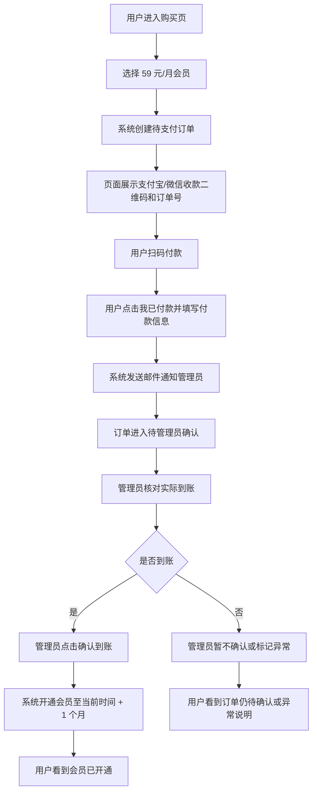

# 支付订阅功能 PRD

## 背景

当前系统已有用户登录、次数余额、订单、管理员后台、订单人工标记已支付、金数据/支付宝相关支付接口基础。现阶段不做自动支付回调闭环，先上线一个人工确认收款模式：用户扫码支付宝或微信付款后点击「我已付款」并提交付款信息，系统通过邮件通知管理员；管理员查看实际到账记录后，在后台点击确认并给用户开通会员。

## 目标

上线 59 元/月订阅购买流程，让普通用户可以在站内获取支付宝/微信收款二维码、点击「我已付款」并提交付款信息；系统邮件通知管理员；管理员在后台核对到账后点击确认，系统为该用户开通 1 个月会员权益。

## 非目标

- 不接入微信支付商户号自动回调。
- 不强依赖支付宝当面付自动回调。
- 不做自动续费。
- 不做退款、发票、优惠券、分销。
- 不替换现有次数包逻辑，先与次数余额并存。

## 用户与角色

- 普通用户：登录后购买 59 元/月会员，扫码付款后点击「我已付款」并提交付款信息。
- 管理员：收到邮件提醒后，查看待确认付款订单，核对真实到账后点击确认开通。
- 系统：记录订单、付款提交信息、发送管理员邮件、会员有效期、管理员操作日志。

## 核心流程

## 产品需求

### 用户端购买页

1. 在现有购买入口中新增或替换为「会员订阅」模块。
2. 展示套餐：
   - 名称：月度会员
   - 价格：59 元/月
   - 权益文案：有效期内可使用平台会员功能，具体扣次/免扣策略见技术设计。
3. 点击购买后创建订单，展示：
   - 订单号
   - 应付金额：59.00
   - 支付宝收款二维码
   - 微信收款二维码
   - 提示：付款时请备注订单号或账号。
4. 用户付款后点击「我已付款」，并提交付款信息：
   - 支付方式：支付宝 / 微信
   - 付款人昵称或姓名
   - 付款时间
   - 实付金额
   - 付款备注/订单号
   - 可选：上传付款截图，第一期可以先不做文件上传，改为填写转账备注。
5. 提交后状态变为「待管理员确认」。
6. 提交成功后，系统立即发送邮件给管理员，提醒管理员核对到账。
7. 用户可以刷新订单状态：
   - 待支付
   - 待确认
   - 已开通
   - 已驳回/异常

### 管理员后台

1. 管理台订单列表增加会员订单展示。
2. 每条订单展示：
   - 订单号
   - 用户账号、邮箱、手机号
   - 套餐名称
   - 金额
   - 用户提交的付款方式、付款人、付款时间、备注
   - 状态
   - 创建时间、提交时间、确认时间
3. 管理员操作：
   - 确认到账并开通
   - 驳回/标记异常
   - 填写管理员备注
4. 确认到账后：
   - 订单状态改为 `paid`
   - 写入 `paid_at`
   - 用户会员到期时间延长 1 个月
   - 记录管理员 ID 和操作时间
5. 如果用户已有有效会员：
   - 默认顺延 1 个月，即从当前 `membership_expires_at` 往后加 1 个月。
   - 如果已过期，则从当前时间加 1 个月。

### 管理员邮件通知

1. 用户点击「我已付款」并提交付款信息后，系统立即发送邮件到管理员邮箱。
2. 管理员邮箱通过环境变量配置：
   - `ADMIN_PAYMENT_NOTIFY_EMAIL`
3. 邮件标题建议：
   - `【盈航】用户已付款待确认 - 59元/月会员 - 订单号 {order_no}`
4. 邮件内容必须包含：
   - 订单号
   - 用户账号 / 手机号 / 邮箱
   - 套餐名称：月度会员
   - 应付金额：59.00
   - 用户选择的支付方式：支付宝 / 微信
   - 用户填写的付款人昵称或姓名
   - 用户填写的付款时间
   - 用户填写的实付金额
   - 用户填写的付款备注
   - 管理后台订单链接
5. 邮件发送失败时：
   - 订单仍进入「待管理员确认」
   - 后端记录错误日志
   - 用户页面提示「已提交付款信息，但管理员通知邮件发送失败，请联系管理员」
6. 如果用户重复点击「我已付款」：
   - 允许更新付款信息。
   - 可以再次发送管理员通知邮件，但需要在邮件中标注「用户更新了付款信息」。

## 权益规则

第一版建议采用「会员有效期 + 保留次数系统」：

1. 用户表新增会员字段：
   - `membership_plan`
   - `membership_status`
   - `membership_expires_at`
2. 有效会员判断：
   - `membership_status = active`
   - `membership_expires_at > now`
3. 会员期间的功能扣次策略：
   - 推荐第一期：会员用户核心 AI 功能免扣次数。
   - 管理员仍保持免扣。
   - 非会员继续使用现有次数余额。
4. 如果后续要限制会员每日次数，可再加 `membership_daily_limit`，第一期不做。

## 技术设计

### 数据模型

复用现有 `orders` 表并扩展字段：

- `product_type TEXT`：`credits` / `membership`
- `package_id TEXT`
- `duration_days INTEGER`
- `payment_method TEXT`：`alipay` / `wechat`
- `payment_submit_status TEXT`：`none` / `submitted`
- `payer_name TEXT`
- `payer_note TEXT`
- `payer_paid_at TEXT`
- `submitted_amount_cents INTEGER`
- `submitted_at TEXT`
- `admin_id INTEGER`
- `admin_note TEXT`
- `confirmed_at TEXT`
- `rejected_at TEXT`

用户表扩展字段：

- `membership_plan TEXT`
- `membership_status TEXT`
- `membership_expires_at TEXT`

也可以新增 `membership_ledger` 表记录每次开通：

- `id`
- `user_id`
- `order_id`
- `plan_name`
- `started_at`
- `expires_at`
- `created_at`
- `admin_id`

推荐：第一期同时写用户表当前状态和 `membership_ledger` 历史记录，便于追溯。

### 后端接口

新增用户端接口：

- `GET /api/pay/membership/plans`
  - 返回 59 元/月套餐和二维码配置状态。
- `POST /api/pay/membership/orders`
  - 创建会员订单。
- `POST /api/pay/membership/orders/{id}/submit`
  - 用户点击「我已付款」并提交付款信息。
  - 写入付款提交信息。
  - 发送管理员通知邮件。
- `GET /api/orders/{id}`
  - 扩展返回会员订单状态和会员开通信息。

新增管理员接口：

- `POST /api/admin/orders/{id}/confirm-membership`
  - 确认到账并开通会员。
- `POST /api/admin/orders/{id}/reject`
  - 驳回/标记异常。

扩展用户信息接口：

- `GET /api/auth/me`
  - 返回 `membership_status`、`membership_expires_at`。

### 前端页面

用户端：

- 优先改造 `frontend/app/billing/page.tsx`
- 从「购买使用次数」升级为「购买会员」
- 保留订单状态刷新按钮
- 展示二维码图片、订单号、付款信息提交表单

管理员端：

- 改造 `frontend/app/admin/page.tsx`
- 订单系统区增加会员订单状态和操作按钮
- 待确认订单醒目展示

### 配置项

新增 `.env` 配置：

- `PAYMENT_MONTHLY_AMOUNT_CENTS=5900`
- `PAYMENT_MONTHLY_PLAN_NAME=月度会员`
- `PAYMENT_ALIPAY_QR_URL=/pay/alipay-qr.jpg`
- `PAYMENT_WECHAT_QR_URL=/pay/wechat-qr.jpg`
- `ADMIN_PAYMENT_NOTIFY_EMAIL=admin@example.com`

二维码图片建议放在：

- `frontend/public/pay/alipay-qr.jpg`
- `frontend/public/pay/wechat-qr.jpg`

## 状态机

订单状态建议：

- `pending`：订单已创建，用户未提交付款信息
- `submitted`：用户点击「我已付款」并提交信息，系统已通知管理员，等待管理员核对
- `paid`：管理员确认到账，会员已开通
- `rejected`：管理员驳回或标记异常
- `expired`：订单超时未提交，可后续增加

## 验收标准

1. 普通用户登录后能创建 59 元/月会员订单。
2. 订单页能展示支付宝和微信二维码。
3. 用户能点击「我已付款」并提交付款方式、付款人、付款时间、金额、备注。
4. 提交后订单进入「待管理员确认」。
5. 提交后系统向管理员邮箱发送付款待确认通知。
6. 提交后管理员后台能看到待确认订单。
7. 管理员点击确认后，订单变为已支付，用户会员有效期增加 1 个月。
8. 用户刷新页面后能看到会员状态和到期时间。
9. 有效会员使用核心 AI 功能时按设计免扣次数。
10. 非会员仍按现有次数余额扣次。
11. 管理员驳回订单后，用户能看到异常状态和备注。
12. 重复点击确认不会重复延长会员。

## 测试计划

- 后端单元测试：
  - 创建会员订单
  - 提交付款信息
  - 提交付款后发送管理员邮件
  - 管理员确认开通
  - 已确认订单重复确认幂等
  - 会员有效期顺延
  - 非管理员不能确认订单
- 前端 lint：
  - `npm run lint -- --file app/billing/page.tsx --file app/admin/page.tsx`
- 接口冒烟：
  - 用户创建订单
  - 用户提交付款信息
  - 管理员确认
  - 用户信息返回会员状态

## 实施拆分

### TASK-1 数据模型与会员权益

- 扩展用户和订单字段。
- 新增会员有效期计算。
- 扩展用户 payload。
- 增加会员免扣判断。

### TASK-2 用户端购买与提交付款

- 新增会员套餐接口。
- 新增创建会员订单接口。
- 新增提交付款信息接口。
- 改造购买页展示二维码和提交表单。

### TASK-3 管理员确认

- 扩展管理台订单列表。
- 增加确认到账按钮。
- 增加驳回/异常备注。
- 确认后开通会员。

### TASK-4 验证与上线配置

- 添加二维码静态资源。
- 配置生产 `.env`。
- 跑后端单测和前端 lint。
- 本地人工验证完整流程。

## 风险

- 人工确认依赖管理员核对，可能有延迟。
- 用户付款备注不填订单号时，管理员需要靠付款人和时间人工匹配。
- 如果二维码被替换或失效，用户无法付款，需要后台配置和展示异常提示。
- 会员免扣策略会影响现有次数收入，需要确认哪些功能纳入会员权益。

## 待确认问题

1. 会员期间是否所有 AI 功能都免扣，还是只开放指定功能。
2. 是否需要用户上传付款截图；第一期建议不做上传，只填付款信息。
3. 支付宝/微信二维码是否使用固定个人收款码图片。
4. 管理员确认后是否发送邮件通知用户。
